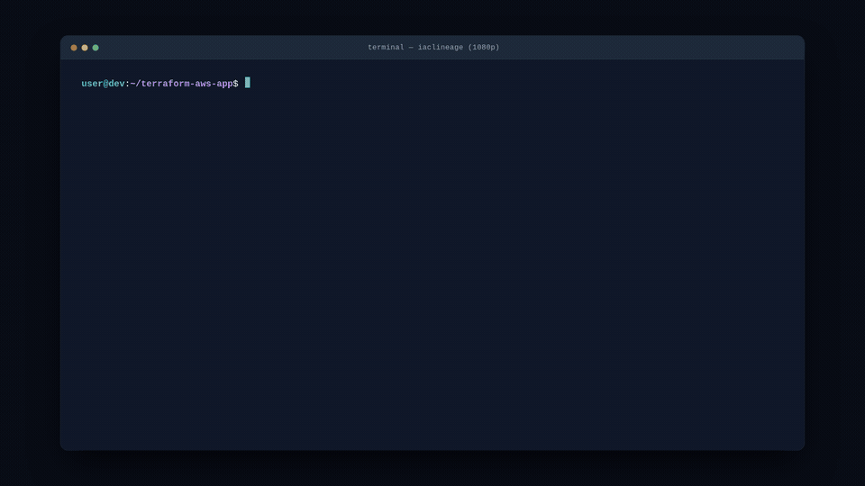

# IaCLineage

Explore Terraform declarations and trace their source references from a local
checkout. IaCLineage provides a Python CLI and a self-contained HTML report with
searchable declarations, field-level lineage, and source locations.

No Terraform execution, cloud credentials, server, or network access is required
to analyze source or open a report. This checkout prepares **0.1.0b2 (beta)**.



## Installation

Requires Python 3.12 or newer. Install from PyPI:

```sh
pip install iaclineage
iaclineage --version
```

To upgrade an existing installation, run `pip install --upgrade iaclineage`.
To explicitly select the latest beta, add `--pre` to the upgrade command.
Cloning this repository is only needed for source development.

See the [tester guide](https://github.com/mayurmhjn/iaclineage/blob/main/docs/tester-guide.md) for TestPyPI installation and the
[platform guide](https://github.com/mayurmhjn/iaclineage/blob/main/docs/platform-support.md) for Windows, Linux, and macOS setup.

## Quick start

Point the CLI at a Terraform root module. Replace these paths with directories
on your machine; the output directory must already exist.

If the project uses registry or remote modules, download their source before
running IaCLineage. Run this inside each Terraform project root:

```sh
cd /path/to/terraform
terraform get
```

[`terraform get`](https://developer.hashicorp.com/terraform/cli/commands/get)
requires Terraform and any credentials needed to download private modules.
Keep the default `.terraform/modules` cache. If the required modules are already
downloaded, this step is unnecessary. Projects using only local modules can skip it.

Then inspect the project:

```sh
iaclineage scan /path/to/terraform
iaclineage find /path/to/terraform aws_vpc.main
iaclineage report /path/to/terraform --format interactive-html --output /path/to/reports/lineage.html
```

Open `lineage.html` locally in Chrome or Edge. Select a declaration, choose a
field, then trace **Upstream**, **Downstream**, or **Both**. References include
the consuming field, target, resolution status, and source range. The report
works offline and can be shared as a single file.

Local module calls are followed automatically, including relative paths outside
the scanned directory. IaCLineage reads downloaded modules through
`.terraform/modules/modules.json`; it never runs Terraform or downloads modules.
Missing remote-module source produces `IAC103` diagnostics and leaves references
into those modules unresolved. The available local source can still be inspected.

## Find declarations

`find` accepts a full IaCLineage address, a standard Terraform resource address,
or a declaration's final name. Exact full addresses take precedence.

```sh
iaclineage find . aws_vpc.main
iaclineage find . resource.aws_vpc.main
iaclineage find . main
iaclineage find . provider.aws.west
iaclineage find . aws --format json
iaclineage find . aws_vpc.main --format json --output /path/to/results.json
```

Provider aliases have distinct addresses: `provider.aws` and
`provider.aws.west`. Searching `aws` lists matching provider configurations.
Explicit `provider = aws.west` bindings on resources, data sources, and imports
link to the declared provider. Duplicate target addresses remain ambiguous.

Child-module addresses include the call path, such as
`module.network.resource.aws_vpc.main`; `module.network.aws_vpc.main` also works
with `find`. Scanning a directory with no root `.tf` files discovers independent
projects beneath it, each with a prefix such as `production::`.

Text and JSON use the same search exit codes:

| Result | Exit code | JSON shape |
| --- | --- | --- |
| One match | `0` | `{ "query": "...", "match": { ... } }` |
| Multiple matches | `1` | `{ "query": "...", "matches": [ ... ] }` |
| No match | `1` | `{ "error": "no match", "query": "..." }` |

Multiple matches include every declaration and its location. Refine the query
when possible. Progress and diagnostics go to stderr, leaving stdout suitable
for JSON consumers. Use `--color never` before the command to disable color.

## Reports

```sh
# Interactive explorer
iaclineage report . --format interactive-html --output /path/to/reports/lineage.html

# Static HTML summary (the default format)
iaclineage report . --output /path/to/reports/summary.html

# Structural JSON
iaclineage report . --format json --output /path/to/reports/lineage.json
```

Reports exclude raw source values by default. To inspect source in a trusted
local interactive report, use `--include-source-values`:

```sh
# Static HTML summary with RAW source values
iaclineage report . --format interactive-html --include-source-values --output /path/to/reports/lineage-with-source.html
```

This option is available only with `--format interactive-html`. The resulting
file can contain secrets, comments, and literal values; review it before sharing.
Keep report files outside scanned repositories and followed modules.

The interactive report includes declaration and field search, project and kind
filters, module input/output connections, conditional evidence, and a resizable
lineage workspace. See the [interactive report guide](https://github.com/mayurmhjn/iaclineage/blob/main/docs/interactive-report.md)
for controls and tracing behavior.

## Analysis scope

- Analyzes `.tf` source using a parser; does not read plan/state JSON or evaluate Terraform.
- Resolves declarations and static references across local and installed modules.
- Treats dynamic-block and comprehension iterators as local symbols. Built-ins
  such as `terraform.workspace`, `path.module`, `each`, and `count` do not create entity edges.
- Keeps references in iterator collections and other external expressions.
  Iterator values themselves are not evaluated or expanded into infrastructure instances.
- Reports missing module sources and parse recovery as diagnostics. Unresolved
  references remain visible; source resolution does not verify provider-computed values.
- Does not resolve implicit provider inheritance or module `providers` mappings.
  Custom `TF_DATA_DIR` and remote state resolution are unsupported.

A missing source reference does not prove runtime independence. Tracing stops
at expression and instance-selection boundaries. Installed module snapshots
also do not prove cache freshness or version-constraint satisfaction.

## Development

```sh
uv sync --locked --group dev
uv run --no-sync pytest
node --test tests/test_lineage_ui.cjs
npm ci --ignore-scripts
npm run test:browser
```

Node and Playwright are developer tools only. Browser setup and native-platform
checks are documented in the [platform guide](https://github.com/mayurmhjn/iaclineage/blob/main/docs/platform-support.md).
See [CONTRIBUTING.md](https://github.com/mayurmhjn/iaclineage/blob/main/CONTRIBUTING.md) for contribution guidelines and
[CHANGELOG.md](https://github.com/mayurmhjn/iaclineage/blob/main/CHANGELOG.md) for release notes.

Report bugs through [GitHub Issues](https://github.com/mayurmhjn/iaclineage/issues)
with the installed version and a synthetic example. Report security issues
privately as described in [SECURITY.md](https://github.com/mayurmhjn/iaclineage/blob/main/SECURITY.md).

Licensed under [Apache License 2.0](https://github.com/mayurmhjn/iaclineage/blob/main/LICENSE).
